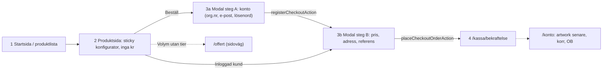
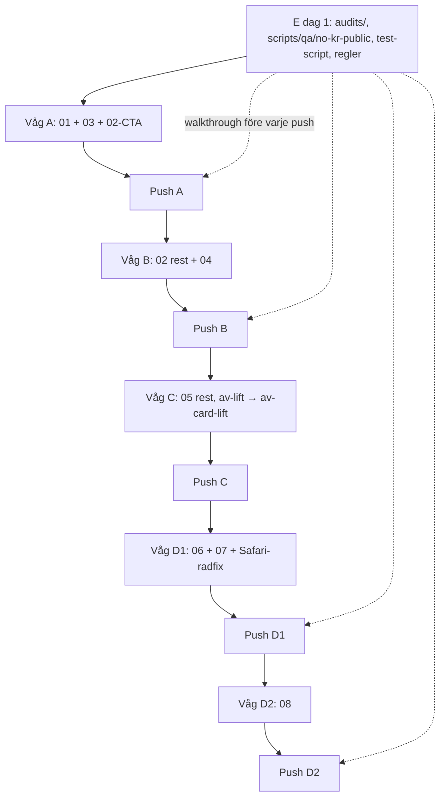

# Masterplan — BBB-mönster till Aqua Visibility OS

Datum: 2026-09-03. HEAD `18473b6`. Förebild: `/Users/christophergenberg/Desktop/Billboardbee-2.0`
("BBB"). Mål: detta repo ("Aqua"). Det här dokumentet är ingången. Fil 01–09 äger
innehållet i varje delmoment, fil 10 äger ordningen, det här indexet äger de
**bindande besluten** där filerna annars skulle säga olika saker.

Prioritet vid konflikt: `00-INDEX §3` > delfil (vad) > `10` (när).

---

## 1. Vad vi bygger, i en mening

En helt ny kund går från startsidan till lagd order på **högst fyra skärmar**, utan
att se ett enda `kr` innan kontot finns; sajt, kassa och alla fyra dashboards får
BBB:s rörelsespråk, sidkomposition och åtgärdsdrivna hem — i Aquas färger, utan nya
paket, utan att röra serverpris, OB-lås eller rollgränser.



Läget i dag: ny kund kan **inte** beställa själv (0 self-serve). `/kassa` är en
redirect, `/offert` skapar bara en staff-notis, ingen publik registrering finns.

## 2. Filerna

| Fil | Äger | Våg | Storlek |
| --- | --- | --- | --- |
| [01-kopflode-4-skarmar.md](01-kopflode-4-skarmar.md) | Actions, routing, statusflöde, Prisma-fält, mejl-idempotens, stegräkning | A | M |
| [02-produktsida-som-kassa.md](02-produktsida-som-kassa.md) | `ProductConfigurator`, `ProductStickyBar`, produktsidans layout, kort = länkar | A (CTA) + B | M |
| [03-registrering-i-kassan.md](03-registrering-i-kassan.md) | `OrderModal` steg A/B, Zod-fält, org.nr-port + mock, inline-login, dubblettskydd | A | M |
| [04-startsida-tre-akter.md](04-startsida-tre-akter.md) | Hero, `StepScrollScrub`, produktband, StatsBand, FeatureSplits, FAQ, ClosingCta, bildbehov | B | L |
| [05-designsystem-motion.md](05-designsystem-motion.md) | Token-diff, alla nya CSS-klasser (klistringsklara), Reveal-gate, `Faq`, `FeatureChip`, `shape="pill"` | A (del) + C | M |
| [06-dashboard-shell-och-kit.md](06-dashboard-shell-och-kit.md) | `AppShell` mobil, `nav.ts`, `NeedsAttention`, `StatusInfo`, `QuickLinks`, `StepIndicator`, `statusHint` | D1 | M |
| [07-kundportal-hem-och-orderhub.md](07-kundportal-hem-och-orderhub.md) | `/konto` hem, `customerActionFor`, peek som hub, post-order artwork-steg | D1 | M |
| [08-operations-labels-bottler.md](08-operations-labels-bottler.md) | `/operations` hem, kundgranskning, `ArtworkReviewCard`, `SupplierDesk` utan kr | D2 | M |
| [09-agent-metod-regler-qa.md](09-agent-metod-regler-qa.md) | Sex alwaysApply-regler, `scripts/qa/`, `audits/`, walkthrough-skill, daily memory, Hands | E | L |
| [10-vagor-och-sekvens.md](10-vagor-och-sekvens.md) | Utgångsläge, Rör inte, vågordning, gates, workboard-kort | — | — |

Alla tio är skrivna mot verklig kod med radnummer verifierade 2026-09-03. Fyra
felaktigheter i uppdragstexten rättades av skrivarna och gäller nu: BBB:s
`MaterialReviewCard` ligger i `src/components/dashboard/`; `steps/toast/back-link`
ligger i `src/components/`, inte `ui/`; BBB har ingen `src/components/ui/cards.tsx`;
Aquas `BuyerOrderTable` bor i `src/ui/order/BuyerOrderCard.tsx` och
`customerApproveProof` i `artwork.service.ts`.

## 3. Bindande beslut (löser motsägelser mellan filerna)

Dessa gäller framför delfilernas text. Delfilerna 01, 02, 03, 05, 08 och 10 har
rättats eller fått ett hänvisningsblock.

1. **Tre server actions** i ny `src/actions/checkout.ts`:
   `registerCheckoutAction(prev, formData)`, `placeCheckoutOrderAction(prev, formData)`,
   `previewPriceAction({ variantId, qty })`. Namnet `registerAndOrderAction` används inte.
2. **Scheman** i `src/domain/schemas/checkout.ts` (mappen finns, är tom):
   `checkoutRegisterSchema`, `checkoutOrderSchema`, `orgNrSchema`. Fältlistan är 03:s;
   `src/domain/orgNr.ts` med Luhn + test.
3. **Steg A = konto**: org.nr (slagning fyller företagsnamn + adressförslag), företag,
   e-post, lösenord ≥ 8, telefon. **Steg B = pris + leveransadress (förifylld) +
   fakturareferens + "Godkänn villkoren & beställ"**. Inloggad kund börjar i B.
4. **`createSelfServeCustomer`** i `customer.service.ts` skapar i en transaktion
   `Company` (orgNr `@unique` = kapningsskydd) → `Customer` (`priceListId` =
   `findUniqueOrThrow({ code: "STANDARD" })`, `companyId`, `orgNr`,
   `source: "self_signup"`, `verifiedAt: null`) → `User` (`role: CUSTOMER`,
   `customerId`, `bcrypt.hash(pw, 10)`). Ingen adress här; adressen skapas i
   `placeCheckoutOrderAction` som `Address(SHIPPING)`.
5. **Prisma-tillägg (alla i Våg A steg 1)**: `Order.receivedMailSentAt DateTime?`,
   `Order.clientToken String? @unique`, `Customer.source String @default("staff")`,
   `Customer.verifiedAt DateTime?`. Seed sätter `verifiedAt = now()` på demo-kunder.
   `lockedAt`, `priceSnapshotJson`, `OrderStatus` rörs inte.
6. **Dubblettskydd**: `clientToken` (UUID per öppnad modal) skickas i båda stegen;
   `placeCheckoutOrderAction` returnerar befintlig order vid träff. Fallback utan token:
   `findRecentDuplicateOrder` (samma kund, variant, qty, 10 min).
7. **Efter order**: `redirect("/kassa/bekraftelse?order=AV-…")` direkt. Ingen "done"-vy i
   modalen. Bekräftelsen är skärm 4 och kräver `CUSTOMER` + `assertBuyerCanAccess`.
8. **Mejl "Order mottagen"** ägs av 01: `after(() => sendOrderReceivedOnce(id))`,
   stämplar `receivedMailSentAt`, respekterar `EMAIL_PAUSED`. 05 äger inga mejl.
9. **Inline-login** i steg A vid befintlig e-post: `signIn` med angivet lösenord; bara
   `CUSTOMER` med `customerId` släpps vidare, andra roller får `signOut` + "Det här kontot
   kan inte beställa." Så ser LABEL/BOTTLER/staff aldrig kr i kassan.
10. **Testrunner**: `node:test` via `tsx`. Våg E lägger `"test": "node --import tsx --test
    src/**/*.test.ts"` i `package.json`. Ingen vitest. `playwright-core` som dev-dep är
    ett beslut Våg E tar första dagen (krävs för design-shots/walkthrough).
11. **Lyft-klass**: `.av-card-lift` ersätter `.av-lift` (05 §Ändringar). Alla elva
    `av-lift`-förekomster byts i Våg C. Inga två lyftsystem.
12. **`--av-radius-xl` = 20 px** (05), inte 24. `--av-stage-accent` = `--av-blue-100` för
    text på mörk `--av-stage` (accentblå ger bara 2.9:1).
13. **Safari-radbugg** (06 §Vad Aqua har idag): `tokens.css` rad 231–253 sätter
    `position: relative` på `<tr>` och `.av-row-hit::after` med `inset: 0` — exakt
    mönstret BBB varnar för i `ui.tsx` rad 3–5. Åtgärdas i Våg D1 genom att lägga
    `position: relative` på första `<td>` (stretch-länken) i stället för `<tr>`, och
    verifieras i iOS Safari innan D1-push.
14. **MOQ** kommer alltid från `product.moq` (270/540 i seed). `?? 270` i
    `BottleOrderForm.tsx` rad 75 tas bort. Copy skriver aldrig ett hårdkodat antal.
15. **Ingen `/registrera`-sida.** Login-sidan får en rad "Ny kund? Kontot skapas i kassan
    när du beställer." → `/produkter/profilvatten`.
16. **`Skyltochgravyr/skyltmotor/`** rörs inte. Ingen ÅF-portal, ingen agent-chat, ingen
    orange/cerise, inga nya UI-bibliotek, ingen `lucide-react`.

## 4. Kontrakt mellan filerna (gränssnitt som låses innan kod skrivs)

```ts
// 02 → 03 (enda state från panel till modal)
export type ProductSelection = {
  productId: string; variantId: string; qty: number;
  options: { waterType: "stilla" | "kolsyrat"; cap?: string; color?: string };
  designId?: string;
};

// 01 → 02 (inloggad kund; anonym anropar aldrig)
previewPriceAction(input: { variantId: string; qty: number })
  : Promise<{ unitPriceExVat: number; lineExVat: number } | null>;

// 01 → 03 (useActionState-kontrakt)
type CheckoutState =
  | { ok: true; existing?: boolean }
  | { ok: false; error?: string; code?: "EMAIL_TAKEN" | "ORG_TAKEN" | "NOT_A_CUSTOMER" | "NO_PRICE"; fieldErrors?: Record<string, string>; redirectTo?: string };

// 06 → 07/08
statusHint(status: OrderStatusCode, facts: HintFacts, viewer: NavRole): { label: string; tone: Tone };
NAV_BY_ROLE: Record<NavRole, NavItem[]>;   // src/ui/shell/nav.ts

// 07 (input till statusHint, enda källa för "väntar på dig")
customerActionFor(order): "artwork" | "proof" | "invoice" | null;   // src/domain/orderBrief.ts

// 03 → integrations
interface CompanyLookupService { lookup(orgNrDigits: string): Promise<CompanyHit | null>; }
```

## 5. Sekvens för ett stort jobb

Fem vågor, fem push-steg, ~16 arbetsdagar med E parallellt. Detaljer i fil 10.
Varje push: `av-bug-hunter-prepush` mot `origin/main...HEAD` → 0 CRITICAL / 0 HIGH →
rapport i `audits/prepush/<datum>-<kort>.md` → **explicit ja** → `git push`.



### Våg E, dag 1 (före all annan kod) — 09

1. `mkdir audits/prepush audits/walkthrough`; `audits/FORBATTRING-MASTERPLAN.md` från 09:s mall.
2. `scripts/qa/no-kr-public.ts` (curl utan cookie mot `/`, `/produkter/**`, `/kassa?variant=`;
   `/\bkr\b|unitPriceExVat|minQty/` = CRITICAL).
3. `package.json`: `"test"` enligt §3.10. Kör befintliga tester gröna.
4. Sex regler i `.cursor/rules/` med `alwaysApply: true` (09 §Ändringar).
5. Beslut om `playwright-core` (dev). Om ja: `scripts/qa/design-shots.mjs`,
   `_probe-overflow.mjs`, `persona-walkthrough.mjs` skrivs löpande under A–D.
6. Skill `.cursor/skills/av-prod-walkthrough/SKILL.md`.
7. Daily note-rutin: varje tur appendar i `.cursor/orchestrator/memory/YYYY-MM-DD.md`.

### Våg A — Köpflöde och kontrakt (01, 03, del av 02) — ~4 dagar

Exakt ordning i fil 10 §Våg A, steg 1–8. Kortversion: Prisma-fält → `previewPriceAction`
+ `ProductSelection` → `createSelfServeCustomer` + idempotens → scheman + `orgNr.ts` +
org.nr-port → `registerCheckoutAction` + `placeCheckoutOrderAction` → `/kassa` +
`/kassa/bekraftelse` → `OrderModal` + knapp på produktsidan → smoke (`tsx` mot SQLite) →
walkthrough → bug-hunt → push.

Klart när: ny besökare från `/` når `/kassa/bekraftelse` på 4 skärmar med 2 submits;
DB har exakt en `Company`, `Customer(STANDARD, self_signup, verifiedAt null)`, `User`,
`Address(SHIPPING)`, `Order(AQUA_REVIEW, source checkout, lockedAt null)`; `no-kr-public`
grönt; dubbelklick ger en order; `kund@demo.aqua` hoppar direkt till steg B;
`labels@demo.aqua` nekas i inline-login.

### Våg B — Startsida och produktsida (02, 04) — ~5 dagar

02 först: `src/domain/bottleVariants.ts`, `ProductConfigurator`, `ProductStickyBar`,
ombyggd `[product]/page.tsx` (BBB-ordning: tillbaka → hero 16/9 → titel → grid
`1fr_400px` → spec-`dl` alla varianter + `printRequirements` + "Så går det till" →
sticky `#bestall`), listsidor med kort som en länk. Sedan 04 sektion för sektion:
`src/ui/home/{Hero,StepScrollScrub,howItWorksSteps,ProductDrift,StatsBand,FeatureSplits,Faq,ClosingCta,ParallaxController}.tsx`,
`PublicNav` transparent → frostad över hero. Bildbeställning dag 1 i vågen (04 §Ändringar
listar filnamn, format, storlekar under `public/home/`); inga placeholders vid push.

Klart när: 02:s tolv kriterier; startsidan har inga tal utan datakälla ("Inget att
betala vid beställning", inte "0 kr"); Lighthouse Perf ≥ 85, CLS ≤ 0.05; reduced-motion
stänger scrub/parallax; 390 px utan horisontell overflow; alla CTA leder till
produktsidan, ingen till `/login` eller `/offert`.

### Våg C — Designsystem (05 rest) — ~2 dagar

Token-diff in i `tokens.css` (+8 tokens), alla klasser från 05 §Ändringar (klistringsklara),
`Reveal` med `html.js`-gate och `variant="public" | "dash"`, `Button shape="pill"`,
`FeatureChip`, `src/ui/public/Faq.tsx`, marquee pause-on-hover, ett samlat
reduced-motion-block, `.av-lift` → `.av-card-lift` i elva filer, fem hex tokeniserade.

Klart när: `rg "av-lift\b" src` = 0; `rg "#f5a623|#de3163" .` = 0; ingen hex i
`src/ui/**/*.tsx`; `package.json` utan nya dependencies; innehåll synligt utan JS;
visuell diff på `/`, `/produkter/profilvatten`, `/kassa`, `/konto`, `/operations`.

### Våg D1 — Shell, kit, kundportal (06, 07) — ~3.5 dagar

06: `src/ui/shell/nav.ts` (`NAV_BY_ROLE` för CUSTOMER/AQUA/LABEL/BOTTLER, bara befintliga
routes), `AppShell` med fixed aside + mobil topbar/tabbar (4 + Mer)/drawer (Esc, overlay,
`inert`), user-block, Inställningar/Logga ut i fot; `NeedsAttention`, `StatusInfo`,
`QuickLinks`, `StepIndicator`, `KpiCard hint`; `src/domain/statusHint.ts` + test;
Safari-radfix (§3.13). 07: `customerActionFor` i `orderBrief.ts`, `/konto` hem
(NeedsAttention → 4 KPI → senaste 5 → QuickLinks; tom-läge för nyregistrerad kund),
`BuyerOrderDetail` med tidslinje överst + en primär åtgärd + sammanslagen
artwork/korr-panel, `?order=X&steg=artwork|korr`, `view=action` i orderlistan.

Klart när: fem demo-konton landar rätt på 375 och 1280 px; tabbar/drawer med tangentbord;
`statusHint`-test grönt; "Väntar på dig" = antal `customerActionFor !== null`; iOS
Safari öppnar rader korrekt.

### Våg D2 — Operations, etikett, bottler (08) — ~1.5 dagar

`/operations` hem med fyra åtgärds-KPI (att bekräfta · nya kunder · i produktion · att
fakturera) + `NeedsAttention` + senaste 10 + QuickLinks; `/operations/kunder` med "Ny,
ej verifierad" + `verifyCustomer` (kräver prislista); `ArtworkReviewCard` med
`rejectArtwork` → `AQUA_REJECTED`; `SupplierDesk` med KPI utan kr, `NeedsAttention` per
roll, en knapp per jobbrad; `statusHint`-ordböcker för LABEL/BOTTLER.

Klart när: `labels@`/`bottler@` HTML innehåller aldrig `kr`; `rg -n
"sendObAction|verifyCustomer|rejectArtwork" src/lib/orchestrator` = 0; självregistrerad
kund från Våg A syns i granskningskön.

## 6. Grindar och förbud

- `deploy`: bug-hunt 0/0 + explicit ja. Fem gånger.
- `irreversible`: Fakturera, Markera betald, slutlig OB — aldrig av automation, aldrig i
  walkthrough (`NEVER_CLICK` i 09), aldrig i Hands.
- `email`: `EMAIL_PAUSED` respekteras av `sendOrderReceivedOnce`; walkthrough körs med
  `EMAIL_PAUSED=1`.
- Förbjudet i alla vågor: nytt UI-bibliotek, orange/cerise, publika `kr`, ÅF-portal,
  agent-chat, ändra `sendOrderConfirmation`/`advanceOrder`/middleware-matchern/prislistnamn,
  Three.js, riktig LLM i studion, Prisma 7, hela-repo-städ, `no-github`-regeln från BBB
  (Aqua deployar via `main`).

## 7. Workboard

Elva kort finns färdiga i fil 10 §Ändringar (JSON i `workboard.json`-format). Claima
`wb-mp-e-metod-qa` och `wb-mp-a-kopflode` först (`status: doing`), resten `inbox`.
Push-korten bär `gate: "deploy"`. Kortet `wb-bbb-masterplan` sätts `done` när detta
index är läst och godkänt.

## 8. Vad som inte portas från BBB, och varför

| BBB | Skäl |
| --- | --- |
| Pris före konto (`booking-modal.tsx` rad 324–329) | Bryter "inga publika kr" |
| `bb_uk`-cookie + `adoptAnonymousData` | Aqua har inga anonyma utkast i V1 (studion kräver session) |
| Multi-turn agent `/boka`, cart-UI, `/dashboard/checkout` | Avvecklade i BBB:s egen kod |
| Orange `#f5a623`, cerise `#de3163`, Inter som display | Aquas färger och Fraunces behålls |
| `lucide-react`, Unovis, Leaflet | Inga nya paket; inline-SVG |
| Ägare ser intäkter i kr (`/dashboard/intakter`) | Etikett/bottler ser aldrig kr |
| Seeded plays/CTR i rapporter | Inga påhittade tal |
| Agency/`AgencyClient` | Ingen ÅF-portal i V1 |
| `no-github.mdc` | Railway auto-deployar `main` |

## 9. Efter masterplanen

När alla fem push-steg är gröna: kör `av-prod-walkthrough` mot Railway med fem
throwaway-personas, spara rapporten i `audits/walkthrough/`, uppdatera `MEMORY.md` med
det som håller över veckor (ny kund self-serve, `source/verifiedAt`, `clientToken`,
`NAV_BY_ROLE`, `statusHint`), och stäng alla `wb-mp-*`.
