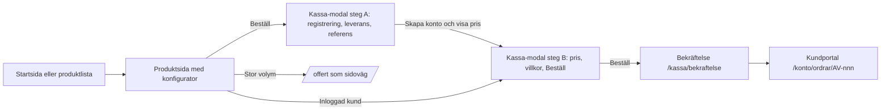

# 01 — Köpflöde på 4 skärmar

Filen äger server actions, routing, statusflöde och stegräkning. 02 äger
produktsidan, 03 modalens UI. Mejlet "Order mottagen" (text + idempotens) ägs här.
Radnummer verifierade 2026-09-03. `BBB/` = Billboardbee-2.0, `AV/` = Par_tryckeri.

> **Bindande beslut efter samgranskning (se `00-INDEX.md` §3).** Tre actions i
> `AV/src/actions/checkout.ts`: `registerCheckoutAction`, `placeCheckoutOrderAction`,
> `previewPriceAction` (signatur i 02). Scheman i `AV/src/domain/schemas/checkout.ts`
> (mappen finns, är tom). Steg A = konto (org.nr, företag, e-post, lösenord, telefon).
> Steg B = pris + leveransadress (förifylld från org.nr-slagning) + fakturareferens +
> Beställ. `createSelfServeCustomer` skapar `Company` (orgNr `@unique` = kapningsskydd)
> → `Customer` (STANDARD, `source: "self_signup"`, `verifiedAt: null`) → `User`, utan
> adress; adressen skapas i `placeCheckoutOrderAction`. Dubblettskydd via
> `Order.clientToken String? @unique` (från 03) med 10-minutersfönster som fallback.
> Efter order: `redirect("/kassa/bekraftelse?order=")` direkt, ingen done-vy i modalen.
> Där texten nedan avviker gäller detta block.

## Mål

Ny besökare utan konto når lagd order på fyra skärmar. Priset visas första
gången i kassan, efter att kontot skapats, före "Beställ". Ordern skapas som
`SUBMITTED` och går direkt till `AQUA_REVIEW`. Kontot får `STANDARD`.



Skärm 3 är en modal med två tillstånd på samma URL. Steg A bara för anonym
besökare. Inloggad kund landar direkt i steg B. Stegräkning efter ändring:

| Besökare | Skärmar | Väg |
| --- | --- | --- |
| Ny, från startsidan | 4 | start → produkt → modal (A→B) → bekräftelse |
| Ny, landar på produktsidan | 3 | produkt → modal → bekräftelse |
| Befintlig, inloggad | 4 | start → produkt → modal B → bekräftelse |
| Befintlig, utloggad | 5 | start → produkt → `/login?next=` → produkt+modal B → bekräftelse |

## Vad BBB gör

BBB låter en anonym besökare boka och skapar kontot i samma modal.

- `BBB/src/components/agent/booking-modal.tsx`
  - Rad 13–19: villkor inline. Rad 19: "Ett konto skapas när du godkänner köpet."
  - Rad 169: `needsAccount = checkedSession && !me`. Kontofält renderas bara då (rad 332–443).
  - Rad 177–183: `ready` kräver kampanjnamn, fakturamärkning; nytt konto: e-post + lösenord ≥ 8 + telefon.
  - Rad 185–263: `authenticate()`. Org.nr = nytt konto → `POST /api/auth/signup` (rad 203–219). 409 → fallback `POST /api/auth/login` (rad 221–232).
  - Rad 265–288: `handleBook()` kör `authenticate()` och sedan `onBook()`. En knapp.
  - Rad 324–329: totalpris visas före registrering. Tillåtet i BBB, förbjudet i Aqua.
- `BBB/src/app/api/auth/signup/route.ts`: rate limit 5/IP (rad 15–17), validering (rad 40–53), befintlig e-post → 409 (rad 56–58), `P2002` → 409 (rad 94–104), `User` + membership + `Organization` i ett `create` (rad 63–93), `adoptAnonymousData` (rad 108–109), `createSession` (rad 121).
- `BBB/src/lib/auth/adopt.ts` rad 11–50: byter `userKey` på anonyma utkast. Kastar aldrig.
- `BBB/src/lib/user-key.ts` rad 4 cookie `bb_uk`; rad 36–43 `getUserKey()` väljer session före cookie, avvisar forgade `u:`-nycklar.
- `BBB/src/lib/bookings.ts` rad 78–105 `findRecentDuplicateBooking()`: idempotensvakt mot dubbelklick. Rad 112 `createDraftBookingRecord()`.
- `BBB/src/app/api/agent/route.ts` rad 137 `book: a.book === true`; rad 279–282 `after(() => sendBookingConfirmationEmails(placedId))`; rad 286–288 cookie sätts på svaret.
- `BBB/src/lib/booking-emails.ts` rad 325 fn; rad 355 `if (booking.confirmEmailsSentAt) return`; rad 410–413 stämplar efter lyckat skick.
- Defaults: `BBB/src/lib/pricing.ts` rad 4 `BASE_SOV = 3`; `BBB/src/lib/utils.ts` rad 66–73 `earliestCampaignStart()`.

Ta med: konto i kassan, idempotent skapande, mejlstämpel, `after()`, 409→login, defaults utan val.
Ta inte med: `bb_uk` och `adoptAnonymousData` — Aqua har inga anonyma utkast i V1 (studion kräver session).

## Vad Aqua har idag

- `AV/src/app/(public)/kassa/page.tsx` rad 1–7 och `kassa/bekraftelse/page.tsx` rad 1–7: redirect-stubbar till `/login` eller `homeForRole`. Ingen kassa.
- `AV/src/app/(public)/produkter/[category]/[product]/page.tsx`: rad 18 `variants[0]` bara för fakta; rad 63–67 CTA "Logga in och beställ" → `/login?next=/konto/ordrar/ny`; rad 71–75 `canSeePrices()`-gate. Ingen `kr` publikt.
- `AV/src/app/(public)/login/page.tsx` rad 26–39: bara inloggning. Ingen registreringslänk. Ingen publik registrering finns.
- `AV/src/app/(public)/offert/page.tsx` + `AV/src/actions/index.ts` rad 58–81 `quoteAction`: `quoteSchema`, `notifyQuoteInquiry()`, redirect `/offert/tack`. Ingen order, kund eller konto.
- `AV/src/middleware.ts` rad 41–46 `needs()`; rad 49–50 `/konto` och `/designa` kräver `CUSTOMER | AQUA_STAFF | AQUA_ADMIN`; rad 58–74 matcher saknar `/kassa` och `/produkter` — redan publika.
- `AV/src/actions/index.ts` rad 83–130 `placeBuyerOrderAction`: kräver session (rad 84–85) och `user.customerId` (rad 109), `createBuyerOrder`, artwork-upload (rad 116–125), redirect `/konto/ordrar/${orderNo}` (rad 127). Rad 34–51 `loginAction` visar att `signIn("credentials", { redirect: false })` fungerar i en action.
- `AV/src/server/services/order.service.ts`
  - Rad 157–162 `resolvePrice()`. Saknas tier → `"Kontakta oss för pris"`.
  - Rad 195–334 `createBuyerOrder()`: `WATER` (rad 221), MOQ (rad 222), serverpris (rad 224–228), adress-fallback `"Anges senare"` (rad 230–242), `SUBMITTED` (rad 282), `StatusEvent` (rad 322–330), `advanceOrder(AQUA_REVIEW)` (rad 331), `email.sendOrderConfirmation` (rad 332).
  - Rad 388–442 `sendOrderConfirmation()` (OB): skriver `priceSnapshotJson` (rad 420) och `lockedAt` (rad 421). Det är låset. Rörs inte.
  - Rad 460–465 `assertBuyerCanAccess()`.
- `AV/src/server/services/catalog.service.ts` rad 50–78 `getPriceListForBuyer()`: kundens lista, annars `STANDARD` (rad 66–68). Rad 80–88 `resolveUnitPrice()`.
- `AV/src/server/services/customer.service.ts` rad 29–65 `createDirectCustomer()`: staff-väg, `priceListId` fritt (rad 51), skapar inte `User`.
- `AV/src/server/auth.ts` rad 17–34 `authorize()`; rad 38–53 `jwt` hydreras från DB, så `customerId` finns direkt efter `signIn`. `AV/src/domain/schemas.ts` rad 14–30 `buyerOrderSchema`, Zod 4.
- `AV/prisma/schema.prisma`: `Role` rad 10–19, `PriceListCode` rad 61–66, `User` rad 121–138 (`customerId String?`), `Customer` rad 168–185 (`priceListId String?`), `Order` rad 296–339 (`lockedAt`, `priceSnapshotJson`, ingen mejlstämpel).
- `AV/src/server/integrations/adapters/mock/index.ts` rad 163–183 `sendOrderConfirmation`: en `Notification` per kundanvändare per anrop. Inte idempotent. Live-adaptern rad 31 är `notImplemented`.
- `AV/src/ui/order/BottleOrderForm.tsx` rad 75 qty-default `moq ?? 270`; rad 182–191 pris i klienten från tiers servern valt för kunden (`konto/ordrar/ny/page.tsx` rad 39–41). Visning; servern repriserar.

Stegräkning idag:

| Besökare | Skärmar | Väg |
| --- | --- | --- |
| Ny | ∞ | start → produkt → `/login` → stopp. Alternativ `/offert` → `/offert/tack` → staff skapar kund och order via `createManualOrderAction` (actions rad 132–205). Self-serve: 0 ordrar. |
| Befintlig, utloggad | 5 | start → produkt → `/login?next=/konto/ordrar/ny` → `/konto/ordrar/ny` → `/konto/ordrar/AV-nnn` |
| Befintlig, inloggad | 4 | start → produkt → `/konto/ordrar/ny` → `/konto/ordrar/AV-nnn` |

## Ändringar

Avvikelse från briefen: `registerAndOrderAction` delas i två actions. Priset
får inte visas före registrering men ska visas före "Beställ". En action hade
gett pris före konto eller Beställ utan pris. Två submits, en skärm.

### `AV/src/domain/schemas.ts` — ändra (S)

Två nya scheman. Adress obligatorisk; `"Anges senare"`-fallbacken (order.service rad 235–237) ska inte träffas från kassan.

```ts
export const checkoutRegisterSchema = z.object({
  company: z.string().trim().min(2).max(120),
  orgNr: z.string().trim().regex(/^\d{6}-?\d{4}$/, "10 siffror"),
  contactName: z.string().trim().min(2).max(80),
  email: z.email().trim().toLowerCase(),
  phone: z.string().trim().min(6).max(30),
  password: z.string().min(8).max(200),
  line1: z.string().trim().min(2),
  postalCode: z.string().trim().min(3),
  city: z.string().trim().min(2),
});

export const checkoutOrderSchema = buyerOrderSchema
  .pick({ variantId: true, qty: true, addressId: true, requestedDate: true, waterType: true, cap: true, color: true, designId: true })
  .extend({ invoiceRef: z.string().trim().min(1).max(80), acceptTerms: z.literal("on") });
```

### `AV/src/server/services/customer.service.ts` — ändra (S)

Ny `createSelfServeCustomer()`. Prislista alltid `code: "STANDARD"`, ingen
parameter för det. `Role` alltid `CUSTOMER`. En transaktion; inget halvskapat konto.

```ts
export async function createSelfServeCustomer(input: z.infer<typeof checkoutRegisterSchema>) {
  const standard = await prisma.priceList.findUniqueOrThrow({ where: { code: "STANDARD" } });
  const passwordHash = await bcrypt.hash(input.password, 10);
  return prisma.$transaction(async (tx) => {
    const customer = await tx.customer.create({
      data: {
        name: input.company, orgNr: input.orgNr, email: input.email, phone: input.phone,
        priceListId: standard.id, resellerId: null,
        addresses: { create: { type: "SHIPPING", line1: input.line1, postalCode: input.postalCode, city: input.city } },
      },
      include: { addresses: true },
    });
    const user = await tx.user.create({
      data: { email: input.email, name: input.contactName, passwordHash, role: "CUSTOMER", customerId: customer.id },
    });
    return { customer, user, addressId: customer.addresses[0].id };
  });
}
```

### `AV/src/actions/checkout.ts` — skapa (M)

Två actions, `"use server"`, returnerar state för `useActionState` i stället för att kasta.

`registerCheckoutAction(prev, formData)`:

1. Parsa `checkoutRegisterSchema`. Fel → `{ ok: false, fieldErrors }`.
2. Rate limit per IP (ny `AV/src/server/rateLimit.ts`, in-memory, 5/10 min). Som BBB signup rad 15–17.
3. Finns `User` med e-posten: prova `signIn("credentials", { email, password, redirect: false })`. Lyckas → `{ ok: true, existing: true }`. Annars `{ ok: false, error: "Kontot finns. Logga in med ditt vanliga lösenord." }`. BBB:s 409→login (modal rad 221–232).
4. Annars `createSelfServeCustomer()` (`P2002` → "Kontot finns"), sedan `signIn(...)`.
5. `return { ok: true }`. Ingen redirect. Modalen går till steg B; servern räknar pris för sessionens `customerId`.

`placeCheckoutOrderAction(prev, formData)`:

```ts
const user = await getSessionUser();
if (user?.role !== "CUSTOMER" || !user.customerId) return { ok: false, error: "Sessionen saknas. Skapa konto igen." };
const parsed = checkoutOrderSchema.safeParse(fromForm(formData));
if (!parsed.success) return { ok: false, fieldErrors: flatten(parsed.error) };
const dup = await findRecentDuplicateOrder({ customerId: user.customerId, variantId: parsed.data.variantId, qty: parsed.data.qty });
const order = dup ?? await createBuyerOrder({ ...parsed.data, buyerType: "CUSTOMER", customerId: user.customerId, actorRole: "CUSTOMER", source: "checkout" });
if (!dup && file) await uploadArtworkForOrder({ ... });   // som actions/index.ts rad 116–125
redirect(`/kassa/bekraftelse?order=${order.orderNo}`);
```

`"Kontakta oss för pris"` (rad 160) fångas → `{ ok: false, redirectTo: "/offert?product=…&qty=…" }`. Kontot finns kvar.
Tiers till steg B hämtas bara när `user?.customerId` finns, via
`getPriceListForBuyer({ customerId, variantId })` (som `konto/ordrar/ny/page.tsx` rad 12, 39–41). Anonym render får `tiers: []`.

### `AV/src/server/services/order.service.ts` — ändra (S)

1. Ny `findRecentDuplicateOrder()`: samma `customerId`, `variantId`, `qty`, `source: "checkout"`, `createdAt >= now - 2 min`. Som BBB `findRecentDuplicateBooking` rad 78–105.
2. Rad 332: byt `await getIntegrations().email.sendOrderConfirmation(order.id)` mot `after(() => sendOrderReceivedOnce(order.id))`. `after` finns i `next/server` i Next 15.5.12 (verifierat). Ordern returneras även om mejl fallerar.
3. Ny `sendOrderReceivedOnce(orderId)`:

```ts
async function sendOrderReceivedOnce(orderId: string) {
  const o = await prisma.order.findUnique({ where: { id: orderId }, select: { receivedMailSentAt: true } });
  if (!o || o.receivedMailSentAt) return;
  try {
    await getIntegrations().email.sendOrderConfirmation(orderId);
    await prisma.order.updateMany({ where: { id: orderId, receivedMailSentAt: null }, data: { receivedMailSentAt: new Date() } });
  } catch (err) {
    console.error("[order] received-mail failed", orderId, err);
  }
}
```

### `AV/prisma/schema.prisma` — ändra (S)

`Order`: `receivedMailSentAt DateTime?` efter `lockedAt` (rad 318). Motsvarar BBB
`Booking.confirmEmailsSentAt`. `prisma db push` lokalt. `lockedAt`,
`priceSnapshotJson` och `Customer.priceListId` rörs inte.

### `AV/src/app/(public)/kassa/page.tsx` — ersätt (M)

Riktig sida. Läser `?variant=&qty=&waterType=&cap=&color=`. Renderar samma `CheckoutPanel` (03) som helsida. Fallback för deep-länk och no-JS.

```ts
const user = await getSessionUser();
const variant = await prisma.productVariant.findFirst({ where: { id, isActive: true, product: { category: "WATER", isPublic: true } }, include: { product: true } });
if (!variant) notFound();
const qty = Math.max(Number(sp.qty) || 0, variant.product.moq);
const tiers = user?.customerId ? (await getPriceListForBuyer({ customerId: user.customerId, variantId: variant.id }))?.items ?? [] : [];
return <CheckoutPanel variant={variant} qty={qty} tiers={tiers} sessionUser={user} />;
```

`LABEL | BOTTLER | FACTORY | RESELLER` → `redirect(homeForRole(role))`. Staff ser sidan; knappen blir "Skapa order i Master Dashboard".

### `AV/src/app/(public)/kassa/bekraftelse/page.tsx` — ersätt (S)

`requireRole(["CUSTOMER"])`, `getOrderByNo(sp.order)`, `assertBuyerCanAccess(order, user)`.
Visar ordernummer, produkt, antal, styckpris och radbelopp ex moms
(`canSeePrices`), preliminärt datum, status via `BUYER_STATUS` (`enums.ts`
rad 42–43). Text: "Agenten har meddelat Aqua. Slutlig orderbekräftelse med
korrektur kommer inom 24 timmar." Länkar till `/konto/ordrar/${orderNo}` och
`/konto`. Saknas `?order` → `redirect("/konto/ordrar")`.

### `AV/src/middleware.ts` — ändra (XS)

Ingen ny regel. `/kassa` ska inte in i `matcher` (rad 58–74). Kommentar vid
matchern: publika med avsikt; skyddet ligger i `placeCheckoutOrderAction`.
`/designa` förblir skyddad; "artwork senare" går via fil-upload i modalen
eller `/konto/ordrar/[orderNo]`, inte via studion.

### `AV/src/app/(public)/login/page.tsx` — ändra (XS)

Efter rad 39: "Ny kund? Kontot skapas i kassan när du beställer." →
`/produkter/profilvatten`. Ingen separat `/registrera`-sida.

### `AV/src/app/(public)/offert/page.tsx` — ändra (XS)

Sidoväg. Rad 17–23: "Offert är för stora volymer, specialformat eller frågor.
Standardsortimentet beställer du direkt på produktsidan." Kassan länkar hit
när `resolvePrice` saknar tier.

### Defaults (ägs här, renderas i 02/03)

- `qty` = `product.moq`. Ta bort `?? 270` i BottleOrderForm rad 75.
- Variant = `product.variants[0]` (produktsidan rad 18). Vatten/kork/färg via `parseBottleOptions`.
- `requestedDate` tomt; `preliminaryDate` sätts av servern (order.service rad 274).
- Artwork: valfri fil i steg B (samma `accept` som BottleOrderForm rad 245). Ingen fil → "senare".
- `invoiceRef` obligatorisk. Motsvarar BBB:s `orderMark`.

### Gränsdragning mot 02 och 03

- 02: konfigurator på `/produkter/[category]/[product]`, CTA "Beställ" som öppnar modalen med `variantId` + `qty`, startsidans CTA (`(public)/page.tsx` rad 36). Inga priser, inga actions.
- 03: `CheckoutPanel`/`CheckoutModal`, steg A/B, `useActionState`-koppling, felvisning, villkor, mobil. Använder exakt de två actions och scheman här.
- 01: scheman, `createSelfServeCustomer`, actions, `findRecentDuplicateOrder`, `sendOrderReceivedOnce`, prisma-fältet, `/kassa`- och bekräftelsesidans dataflöde, middleware, länkar, stegräkning.

## Kontraktskontroll

- **Pris räknas på servern.** `placeCheckoutOrderAction` skickar aldrig pris. `createBuyerOrder` rad 224–228 räknar via `resolvePrice`. Steg B visar tiers servern valt för sessionens kund; det är visning.
- **Checkout repriserar.** Ja. `OrderItem.unitPriceExVat` kommer från `resolvePrice` (rad 298), inte från modalen.
- **Snapshot låses vid OB.** Oförändrat. `priceSnapshotJson` och `lockedAt` skrivs bara i `sendOrderConfirmation` rad 420–421. Kassan skriver inget av dem. `receivedMailSentAt` är separat och rör inte låset.
- **När syns pris första gången.** Efter lyckad `registerCheckoutAction` (session med `customerId`), i modalens steg B. Anonym render av produktsida, `/kassa` och steg A har inga tiers och ingen `kr`. Verifieras med kriterium 3.
- **Inga publika `kr`.** Produktsidan gate rad 71–75. `/kassa` skickar `tiers: []` utan session. `/kassa/bekraftelse` kräver `CUSTOMER`.
- **Prislistor blandas inte.** Nya kunder får `STANDARD` via `findUniqueOrThrow({ code: "STANDARD" })`. Befintliga prissätts via egen `Customer.priceListId` (`getPriceListForBuyer` rad 65–66). En kund per request.
- **STANDARD kan inte väljas bort av kunden.** `checkoutRegisterSchema` har inget prislistefält. `createSelfServeCustomer` tar ingen sådan parameter. Bara staff byter via `updateCustomer` (customer.service rad 67–83).
- **Etikett/bottler ser inte fakturor eller `kr`.** `ProductionJob` skapas utan pris (rad 314–320), som idag. `/labels` och `/bottler` ändras inte.
- **Ingen ÅF-portal.** `Role` hårt `CUSTOMER`, `resellerId: null`. `/partner` → login kvarstår (middleware rad 11–13).
- **Statusflöde.** `SUBMITTED` → `AQUA_REVIEW` via `advanceOrder` rad 331, styrt av `ORDER_STATUS_TRANSITIONS` (enums rad 128). Inget nytt tillstånd.
- **Idempotens.** Order: `findRecentDuplicateOrder`. Mejl: `receivedMailSentAt` + `after()`. Konto: `$transaction` + `P2002`-fångst.
- **"agenten", aldrig AI.** Bekräftelsesida och mejl.
- **`irreversible`-grinden.** Kassan rör inte Fakturera, Markera betald eller Slutlig OB.

## Acceptanskriterier

1. Ny besökare utan konto, från `/`, når `/kassa/bekraftelse?order=AV-…` på 4 skärmar med 2 submits. Ordern har `currentStatus = AQUA_REVIEW`, `buyerType = CUSTOMER`, `source = "checkout"`.
2. Efter 1 finns exakt en `User` (`role = CUSTOMER`, `customerId` satt), en `Customer` med `priceListId` = id för `PriceList.code = STANDARD`, och en `Address` av typ `SHIPPING`.
3. `curl -s` mot `/`, `/produkter/profilvatten`, `/produkter/profilvatten/<slug>` och `/kassa?variant=<id>` utan cookie: ingen träff på `/\bkr\b/`, `unitPriceExVat` eller `minQty` i HTML.
4. Inloggad som `kund@demo.aqua`: `kr` förekommer bara i kassans steg B och på bekräftelsesidan.
5. Registrering med befintlig e-post och rätt lösenord → inloggad, steg B, inget nytt konto. Fel lösenord → "Kontot finns…", ingen ny `User`, ingen order.
6. Dubbelklick på Beställ inom 2 minuter → `Order.count` ökar med 1.
7. Två anrop av `sendOrderReceivedOnce(orderId)` → en `Notification` "Order mottagen", `receivedMailSentAt` satt.
8. Order via kassan har `lockedAt = null` och `priceSnapshotJson = null` tills staff kör `sendObAction`. Efter OB är båda satta.
9. Kund med `priceListId = GOLD` får `OrderItem.unitPriceExVat` från GOLD, inte STANDARD.
10. `LABEL`/`BOTTLER` på `/kassa` → sin hemvy. `/kassa/bekraftelse` utan `CUSTOMER`-session → `/login?next=`.
11. Antal under MOQ → "Minsta antal är N" i modalen; ingen order. Variant utan tier → länk till `/offert?product=…&qty=…`; kontot finns och är inloggat.
12. Ingen sträng "AI", "GPT" eller modellnamn i `/kassa`, `/kassa/bekraftelse` eller mottagen-mejlet. "agenten" används. `npm run build` grön; bug-hunt utan CRITICAL/HIGH.

## Beroenden

- **02**: konfigurator som ger `variantId`, `qty`, `waterType`, `cap`, `color`; CTA som öppnar modalen eller länkar `/kassa?variant=…&qty=…`. 01 testas via `/kassa`-helsidan innan 02 är klar.
- **03**: `CheckoutPanel` steg A/B kopplad till `registerCheckoutAction` och `placeCheckoutOrderAction`; fältnamn exakt enligt scheman här. 03 lägger inte till fält utan att 01 uppdateras.
- **07**: kundportalens hem och orderhub tar emot den nyregistrerade kunden efter bekräftelsen. 01 levererar `/kassa/bekraftelse` och mejlet; 07 äger vad kunden ser i `/konto`.
- **08**: `Customer.source`/`verifiedAt` konsumeras av ops kundgranskning. 01 sätter fälten.
- Ordning: 01 → 03 mot `/kassa` → 02 kopplar modalen → 07/08.

## Uppskattad storlek

| Delmoment | Storlek |
| --- | --- |
| `checkoutRegisterSchema`, `checkoutOrderSchema` | S |
| `createSelfServeCustomer` med transaktion | S |
| `actions/checkout.ts` (två actions, felmappning, rate limit) | M |
| `findRecentDuplicateOrder` + `sendOrderReceivedOnce` + `after()` | S |
| `Order.receivedMailSentAt` + `db push` + seed-kontroll | S |
| `/kassa` helsida (dataflöde; UI från 03) | M |
| `/kassa/bekraftelse` | S |
| Middleware-kommentar, login-/offert-länkar, `?? 270` bort i `BottleOrderForm` | XS |
| Smoke-script för kriterium 1–9 (`tsx` mot lokal SQLite; repot har ingen testrunner) | M |
| Bug-hunt + push | S |
