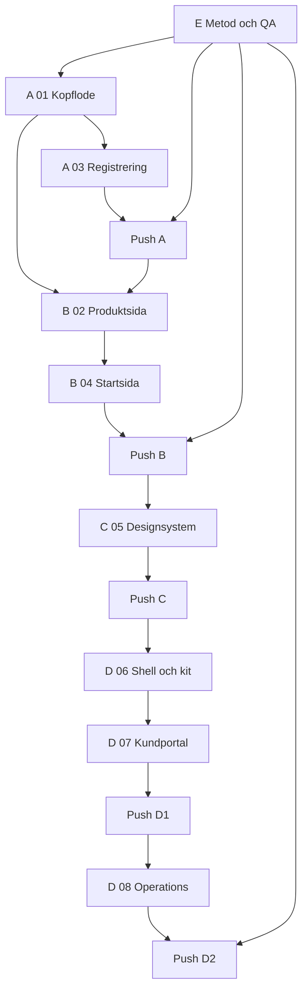

# 10 · Vågor och sekvens

Förebild: Billboardbee 2.0 (`/Users/christophergenberg/Desktop/Billboardbee-2.0`, "BBB").
Mål: Aqua Visibility OS (`/Users/christophergenberg/Desktop/Par_tryckeri`, "Aqua").
Den här filen äger **ordningen**. Fil 01–09 äger innehållet i varje delmoment.
Vid konflikt om *vad* gäller delfilen; vid konflikt om *när* gäller den här.

## Mål

En exekverbar sekvens med tydliga grindar. Fem vågor (A–E) i BBB:s format
`audits/FORBATTRING-MASTERPLAN.md`: först det som inte får förstöras, sedan
det som ger mest värde per push, sist metod och QA som löper parallellt från dag 1.

Varje våg slutar i ett push-steg med grind `deploy`: `av-bug-hunter-prepush`
med 0 CRITICAL / 0 HIGH och explicit ja från produktägaren. Kodarbete har grind
`none`. Ingenting i planen trycker `Fakturera`, `Markera betald` eller slutlig OB
(`irreversible` i `src/lib/orchestrator/approvals.ts`, rad 30–34).

## Vad BBB gör

`audits/FORBATTRING-MASTERPLAN.md` är mallen. Strukturen:

1. **Utgångsläge (får inte förstöras)** — en rad: produktionsvandringen är
   0/0/0 på rollkopplingar. "Vi lagar och förtydligar — vi ritar inte om sajten."
2. **Det som redan är starkt (rör inte utan anledning)** — sju punkter med fil
   (`src/lib/seo.ts`, `src/lib/signs.ts`, `skyltar-client.tsx`).
3. **Våg A — Pengar och säkerhet (först)**: PATCH får inte sätta `totalPrice`
   från klienten, `/api/upload` utan session. Efter A: `prod-walkthrough` + bug-hunt.
4. **Våg B — Vägar som slutar fel**, **Våg C — Mobil och kakor**, **Våg D — Roller**
   (byrå/ägare/annonsör var för sig), **Våg E — Copy, engelska, mejl, cutover**.
5. **Exekvering**: "Observera → lista → laga en sak → verifiera → vandring efter
   A/B/D. Förbjudet: nytt designsystem, ny nav-modell, QueenCloud Koppla, Railway,
   hela-repo-städ. Default: Våg A först. Deploy bara när du säger till, med
   `bbb-bug-hunter-prepush`."

Vågorna knyts till bevis, inte till känsla: `audits/prod-walkthrough/<id>/`
(per körning), `audits/persona-army/`, `audits/prod-smoke/`, `scripts/qa/`
(24 skript, bl.a. `_skarm_scope.ts` som `audits/CUTOVER.md` kräver körs mot prod
före DNS). Regeln `.cursor/rules/prepush-bughunt.mdc` (alwaysApply) gör bug-hunten
till en hård grind före varje AWS-deploy, och listar exakt vilka kommandon som
räknas som deploy. `audits/CUTOVER.md` är en egen checklista: vad som måste vara
grönt innan DNS flyttas, och vad som görs efteråt (smoke: login, boka, ägare ser
bokning). Mönstret: **liten våg → vandring → bug-hunt → deploy på uppmaning**.

## Vad Aqua har idag

**Workboard** (`src/lib/orchestrator/workboard.json`): 25 kort, alla `status: done`
utom `wb-bbb-masterplan` (`doing`). Kortformat: `id, title, body, status, domainId,
playbook, files, gate, source, createdAt, updatedAt` (`src/lib/orchestrator/workboard-types.ts`).
Alla befintliga kort har `gate: "none"` och `playbook: "new-order"` — inget kort har
burit `deploy`, trots att deployer gjorts (`memory/2026-09-01.md` nämner `2b1e106`
live). Grindar finns i `approvals.ts`: `none | deploy | irreversible | email | money`;
`canExecute` kräver `bugHuntClean && explicitYes` för `deploy`.

**Prepush-regel**: `.cursor/rules/prepush-bughunt.mdc` + skillen
`.cursor/skills/av-bug-hunter-prepush/SKILL.md` (tolv anti-regressionskontrakt).
Scope-default `git diff --name-only origin/main...HEAD`. Railway auto-deployar `main`.

**Domänkarta**: `src/lib/orchestrator/graph.ts` — `DomainId` = `public | auth |
customer | operations | labels | bottler | artwork | order | email | freight | money`.
Playbooks: `new-order`, `artwork`, `confirm-ob`, `produce`, `invoice`.

**Saknas:**

- Ingen `audits/`-mapp. Ingen vandringsrapport, inga persona-rundor sparade som
  filer — bara rader i `memory/2026-09-01.md` ("Personarunda: 500:or och demo-hål").
- `scripts/` är tom. Testerna är `node:test` (`src/server/services/catalog.service.test.ts`
  rad 1–5) utan `test`-script i `package.json`.
- Ingen sekvens. Workboardet är en logg över gjort, inte en plan över nästa.
- `/kassa` och `/kassa/bekraftelse` finns men redirectar bara
  (`src/app/(public)/kassa/page.tsx` rad 4–7, `bekraftelse/page.tsx` rad 4–7).
- Ingen walkthrough-skill för Aqua (BBB har `bbb-prod-walkthrough`).

## Ändringar

### Utgångsläge (får inte förstöras)

Verifierat i koden 2026-09-03, HEAD `18473b6`, `origin/main` = HEAD:

- **Serverpris.** `createBuyerOrder` räknar pris via `resolvePrice` →
  `getPriceListForBuyer` + `resolveUnitPrice` (`src/server/services/order.service.ts`
  rad 157–162, 224–228). Klienten skickar aldrig belopp.
- **Snapshot vid OB.** `sendOrderConfirmation` kräver `ARTWORK_CUSTOMER_APPROVAL`
  + `CUSTOMER_FINAL`, bygger `buildPriceSnapshot`, sätter `lockedAt`, flyttar till
  `CONFIRMED` → `LABEL_PRODUCTION` (rad 388–427). `customerApproveProof` går **inte**
  till `CONFIRMED` (`artwork.service.ts` rad 110–125). `repeatOrder` kräver `lockedAt`
  (rad 355). `saveExtras` nekas efter lås (rad 385).
- **StatusEvent är sanningen.** `advanceOrder` skriver event + notis (rad 139–150).
- **Rollgränser.** `middleware.ts` rad 48–55 låser `/konto`, `/designa`, `/operations`,
  `/labels`, `/bottler`. `requireSupplier` skickar fel roll hem (`supplierAccess.ts`
  rad 11–18). `scopedFactoryId` ger `__none__` för leverantör utan fabrik (rad 22–28).
- **Prisvägg.** `canSeePrices` = `CUSTOMER` eller Aqua-admin (`priceVisibility.ts` rad 4–6).
  `publicProductDto` testas utan `unitPrice` (`catalog.service.test.ts`).
- **Peek.** Kundens orderrad öppnar `OrderPeek` (`src/ui/order/OrderPeek.tsx`,
  `KontoOrderPeek.tsx`) via `?order=`; gamla `/konto/ordrar/AV-*` redirectar.
- **Etikett/bottler utan kr.** LR/BF-PDF:er utan belopp
  (`labelDispatch.service.ts`, `bottlerInvoice.service.ts`); Invoice-include borttagen
  (kort `wb-label-persona-fix`).
- **Mejl** respekterar `EMAIL_PAUSED` (`approvals.ts` rad 76–78).

### Rör inte

`Skyltochgravyr/skyltmotor/`. `sendOrderConfirmation`-villkoren. `advanceOrder`.
Prislistnamnen `Standard / Partner / Key Account / Specialavtal`
(`src/domain/priceLists.ts`). Route groups `(public) (konto) (operations) (labels)
(bottler) (studio)`. Middleware-matchern. `homeForRole` (`rbac.ts` rad 52–60).
Demo-konton. Tokens som redan finns i `src/app/styles/tokens.css` byts inte ut —
05 lägger till.

### Våg A — Köpflöde och kontrakt (först)

Ingående: **01** (routing, `registerCheckoutAction` + `placeCheckoutOrderAction` +
`previewPriceAction` i `src/actions/checkout.ts`, `/kassa`, `/kassa/bekraftelse`,
middleware) + **03** (`OrderModal`, Zod-scheman i `src/domain/schemas/checkout.ts`,
org.nr-port + mock, Auth.js `signIn`, duplikatskydd via `clientToken`) + **02** delen
`ProductSelection`-kontrakt + **05** endast det 03 kräver (`.av-peek--checkout`).

Ordning inom vågen:

1. 01: Prisma `Order.receivedMailSentAt`, `Order.clientToken @unique`,
   `Customer.source`, `Customer.verifiedAt`; `db push`; seed-kontroll.
2. 01: `previewPriceAction` (server, `assertCanSeePrices`) och `ProductSelection`-typ.
3. 01: `createSelfServeCustomer` (Company → Customer STANDARD → User, transaktion),
   `findRecentDuplicateOrder`, `sendOrderReceivedOnce` + `after()`.
4. 03: Zod-scheman + `orgNr.ts` (Luhn) + org.nr-port (`src/server/integrations/`) med
   mock-adapter + `lookupCompanyAction`.
5. 01: `registerCheckoutAction` (steg A) och `placeCheckoutOrderAction` (steg B, adress
   + fakturareferens + `createBuyerOrder` oförändrad). Duplikat-e-post → inline-login,
   fel roll → `signOut` + "Det här kontot kan inte beställa."
6. 01: `/kassa` blir helsida som renderar 03:s panel; `/kassa/bekraftelse` blir
   bekräftelse med `requireRole(["CUSTOMER"])`. Middleware-matchern rörs inte.
7. 03: `OrderModal` (steg A/B, nativ `<dialog>`, fullskärm < 640 px) kopplad till
   actions i 5. Produktsidans gamla CTA-block byts mot en knapp som öppnar modalen
   (resten av 02 kommer i Våg B).
8. Vandring: ny kund på 4 skärmar. Bug-hunt. Push.

Gate: `deploy` på steg 8. Acceptans: **ny kund på 4 skärmar utan kr före
registrering**; order landar i `SUBMITTED → AQUA_REVIEW` med `unitPriceExVat` från
`STANDARD`; `curl` anonym produktsida → `grep -c " kr"` = 0. Uppskattning: **L** (4 dagar).

### Våg B — Startsida och produktsida

Ingående: **02** (`ProductConfigurator`, `ProductStickyBar`, kort = länkar) + **04**
(hero med scen-dots, `StepScrollScrub`, produktband, `StatsBand`, `FeatureSplits`,
FAQ, `ClosingCta`, `ParallaxController`).

Ordning: 02 först (panelen är kassans skärm 1), sedan 04 sektion för sektion:
hero → "Så funkar det" → produktband → resten. Bildbehov från 04 beställs dag 1
i vågen; placeholders får inte ligga kvar vid push.

Gate: `deploy`. Acceptans: 02:s tolv kriterier + startsidan utan påhittade tal
(kontrakt #10 i bug-hunt-skillen), inga `kr`, `prefers-reduced-motion` respekteras.
Uppskattning: **L** (5 dagar; 02 = 2–3, 04 = 2–3).

### Våg C — Designsystem

Ingående: resten av **05** — token-diff, `.av-display`, `.av-card-lift`,
`.av-parallax-media`, `.av-site-header[data-scrolled]`, `.av-animate-float/-cue`,
Reveal med html.js-gate (`src/ui/motion/Reveal.tsx` finns), Faq-primitiv.
Konsolidering: ersätt lokala klasser som A/B införde med primitiverna.

Gate: `deploy`. Acceptans: noll nya npm-paket (`package.json` diff bara i `version`
om ens det), `npm run build` grönt, inga hex i JSX. Uppskattning: **M** (2 dagar).

### Våg D — Dashboards

Ingående: **06** → **07** → **08** i den ordningen. 06 (shell: mobil topbar/tabbar/drawer,
central nav per roll, `NeedsAttention`, `StatCard`, `QuickLinks`, `StepIndicator`,
`statusHint`) är beroende för både 07 och 08. 07 (kundportal: 4 KPI, hub-peek med
tidslinje, post-order artwork-steg) före 08 (operations: kundgranskning av
självregistrerade från Våg A, `SupplierDesk` utan kr, artwork-granskning) eftersom
08:s kundgranskning behöver 07:s statusspråk.

Gate: `deploy` efter 06+07 (ett push) och efter 08 (ett push). Acceptans: fyra roller
går hem rätt på 375 px; etikett/bottler-HTML utan `kr`; `Markera betald` renderas bara
för Aqua-admin. Uppskattning: **L** (5 dagar; 06 = 2, 07 = 1.5, 08 = 1.5).

### Våg E — Metod och QA (startar dag 1, parallellt)

Ingående: **09** — alwaysApply-regler per invariant, `scripts/qa/`, `audits/`,
walkthrough-skill (`av-prod-walkthrough`), daily memory, Hands.

Ordning: `audits/` + `scripts/qa/no-kr-public.ts` dag 1 (så Våg A kan bevisas),
walkthrough-skill före Våg A:s push, regler löpande, Hands sist (aldrig
`irreversible | deploy`, se `hands.ts` rad 16). Gate: `none` (bara dokument, skript,
regler — ingen egen deploy; skripten följer med nästa vågs push). Uppskattning:
**M** (2 dagar utspridda).

### Exekvering

Observera → lista → laga en sak → verifiera → walkthrough efter A, B och D.
Före varje push: `av-bug-hunter-prepush` mot `origin/main...HEAD`, 0 CRITICAL /
0 HIGH, explicit ja. Rapporten sparas i `audits/prepush/<datum>-<kort-id>.md`.

Förbjudet: nytt UI-bibliotek, orange, publika `kr`, ÅF-portal, agent-chat i V1,
ändra OB-låsningen (`sendOrderConfirmation`), Three.js, riktig LLM i studion,
`prisma`-bump till 7, hela-repo-städ.

Beroendegraf:



Workboard-kort (samma format som `workboard.json`; `createdAt`/`updatedAt` sätts vid claim):

```json
[
  { "id": "wb-mp-a-kopflode", "status": "ready", "domainId": "order", "playbook": "new-order", "gate": "none", "source": "cursor",
    "title": "Våg A: köpflöde 4 skärmar + registrering i kassan",
    "body": "01+03. /kassa orderar. registerCheckoutAction (Company+Customer STANDARD+User+signIn) och placeCheckoutOrderAction (adress+referens+createBuyerOrder). Org.nr-port mock, clientToken-dubblettskydd, /kassa/bekraftelse. Inga kr före registrering. Serverpris orört.",
    "files": ["src/app/(public)/kassa/page.tsx", "src/app/(public)/kassa/bekraftelse/page.tsx", "src/actions/checkout.ts", "src/domain/schemas/checkout.ts", "src/ui/checkout/OrderModal.tsx", "prisma/schema.prisma"] },
  { "id": "wb-mp-a-push", "status": "inbox", "domainId": "order", "playbook": "new-order", "gate": "deploy", "source": "cursor",
    "title": "Våg A: walkthrough + bug-hunt + push",
    "body": "Ny kund på 4 skärmar. av-bug-hunter-prepush 0 CRITICAL/0 HIGH. Explicit ja. Rapport i audits/prepush/.",
    "files": ["audits/prepush/"] },
  { "id": "wb-mp-b-produktsida-startsida", "status": "inbox", "domainId": "public", "playbook": "new-order", "gate": "none", "source": "cursor",
    "title": "Våg B: produktsida som kassa + startsida tre akter",
    "body": "02: ProductConfigurator sticky, ProductStickyBar, kort=länkar, previewPrice bara inloggad. 04: hero, StepScrollScrub, produktband, StatsBand, FeatureSplits, FAQ, ClosingCta. Inga kr anonym, inga påhittade tal.",
    "files": ["src/app/(public)/produkter/[category]/[product]/page.tsx", "src/app/(public)/page.tsx", "src/ui/public/PublicNav.tsx"] },
  { "id": "wb-mp-b-push", "status": "inbox", "domainId": "public", "playbook": "new-order", "gate": "deploy", "source": "cursor",
    "title": "Våg B: walkthrough + bug-hunt + push",
    "body": "curl anonym produktsida utan ' kr'. Reduced motion. Bug-hunt ren. Explicit ja.",
    "files": ["audits/prepush/"] },
  { "id": "wb-mp-c-designsystem", "status": "inbox", "domainId": "public", "playbook": "new-order", "gate": "none", "source": "cursor",
    "title": "Våg C: designsystem och motion konsoliderat",
    "body": "05 rest: token-diff, av-display, av-card-lift, av-parallax-media, av-stage-panel, header data-scrolled, Reveal html.js-gate, Faq. Inga nya paket. Inga hex i JSX.",
    "files": ["src/app/styles/tokens.css", "src/ui/motion/Reveal.tsx", "src/ui/shell/primitives.tsx"] },
  { "id": "wb-mp-c-push", "status": "inbox", "domainId": "public", "playbook": "new-order", "gate": "deploy", "source": "cursor",
    "title": "Våg C: bug-hunt + push",
    "body": "Build grönt, package.json utan nya deps. Explicit ja.",
    "files": ["audits/prepush/"] },
  { "id": "wb-mp-d-shell-kundportal", "status": "inbox", "domainId": "customer", "playbook": "artwork", "gate": "none", "source": "cursor",
    "title": "Våg D1: dashboard-shell + kit, kundportal hem och orderhub",
    "body": "06: mobil topbar/tabbar/drawer, nav per roll, NeedsAttention, StatCard, QuickLinks, StepIndicator, statusHint. 07: 4 KPI, peek som hub med tidslinje, post-order artwork-steg.",
    "files": ["src/ui/shell/AppShell.tsx", "src/app/(konto)/konto/page.tsx", "src/ui/order/OrderPeek.tsx", "src/ui/order/KontoOrderPeek.tsx"] },
  { "id": "wb-mp-d1-push", "status": "inbox", "domainId": "customer", "playbook": "artwork", "gate": "deploy", "source": "cursor",
    "title": "Våg D1: walkthrough kund + bug-hunt + push",
    "body": "Kund på 375 px: hem, orderhub, artwork-steg. Bug-hunt ren. Explicit ja.",
    "files": ["audits/prepush/"] },
  { "id": "wb-mp-d-operations-supplier", "status": "inbox", "domainId": "operations", "playbook": "confirm-ob", "gate": "none", "source": "cursor",
    "title": "Våg D2: operations, etikett och bottler rollhem",
    "body": "08: kundgranskning av självregistrerade, SupplierDesk utan kr, artwork-granskning. Markera betald bara Aqua-admin. Fakturera/OB trycks aldrig av agenten.",
    "files": ["src/app/(operations)/operations/page.tsx", "src/app/(operations)/operations/kunder", "src/ui/supplier/SupplierDesk.tsx"] },
  { "id": "wb-mp-d2-push", "status": "inbox", "domainId": "operations", "playbook": "confirm-ob", "gate": "deploy", "source": "cursor",
    "title": "Våg D2: walkthrough alla roller + bug-hunt + push",
    "body": "Fem roller går hem rätt. Etikett/bottler-HTML utan kr. Bug-hunt ren. Explicit ja.",
    "files": ["audits/prepush/"] },
  { "id": "wb-mp-e-metod-qa", "status": "ready", "domainId": "operations", "playbook": "new-order", "gate": "none", "source": "cursor",
    "title": "Våg E: regler, scripts/qa, audits, walkthrough-skill, Hands",
    "body": "09. Startar dag 1 parallellt. alwaysApply per invariant, scripts/qa/no-kr-public.ts, audits/, av-prod-walkthrough, daily memory. Hands aldrig irreversible/deploy.",
    "files": [".cursor/rules/", ".cursor/skills/", "scripts/qa/", "audits/", "src/lib/orchestrator/hands.ts"] }
]
```

## Kontraktskontroll

- **Serverpris.** Ingen våg rör `resolvePrice`. Våg A:s `placeCheckoutOrderAction`
  anropar `createBuyerOrder` oförändrad. Våg B:s `previewPriceAction` går via
  `assertCanSeePrices` + `getPriceListForBuyer`. Ingen tier-array till klienten.
- **Snapshot vid OB.** `sendOrderConfirmation` är i "Rör inte". Våg D:s
  `StepIndicator` och tidslinje läser `StatusEvent`, skriver aldrig.
- **Inga publika kr.** A/B: anonym får `canSeePrices=false` och panelen renderar
  ingen prisnod. E dag 1: `scripts/qa/no-kr-public.ts` körs i varje push-kort.
- **Prislistor blandas inte.** Ny kund får `STANDARD` explicit i Våg A — inte via
  fallback. `getPriceListForBuyer` med `customerId` från sessionen, aldrig från formData
  (kontrakt #7).
- **Etikett/bottler utan kr.** Våg D2 ändrar `SupplierDesk` bara i layout; ingen ny
  Prisma-include. Bug-hunt kontrakt #2 gäller varje D-push.
- **Irreversible aldrig av automation.** Inget kort har `gate: irreversible`.
  `Fakturera`, `Markera betald`, slutlig OB är knappar för Aqua, inte steg i planen.
- **"agenten" i text.** All ny copy i 04, 06, 07 säger agenten. Aldrig AI eller modellnamn.
- **Frontend importerar aldrig mock.** Org.nr-mocken (Våg A) ligger under
  `src/server/integrations/adapters/mock` och nås via `composition.ts`.

## Acceptanskriterier

**Våg A.** Anonym besökare: produktsida → Beställ → registrering i modal → bekräftelse,
fyra skärmar, noll `kr` före registrering. Efter: `User` + `Customer(STANDARD)` +
session + `Order SUBMITTED → AQUA_REVIEW` med serverpris. Dubbel e-post → "Logga in".
`/kassa` utan session redirectar inte längre till `/login`.

**Våg B.** 02:s kriterier 1–12. Startsidan: inga tal som inte kommer från data eller
godkänd copy, hero utan layout-shift, `prefers-reduced-motion` stänger scrub/parallax.

**Våg C.** `npm run build` grönt, `package.json` utan nya dependencies, ingen `#hex` i
`src/ui/**/*.tsx`, Reveal fungerar utan JS (innehåll synligt).

**Våg D.** Fem demo-konton landar rätt via `homeForRole` på 375 och 1280 px.
`/labels` och `/bottler` HTML utan ` kr`. Kundhub visar tidslinje från `StatusEvent`.
Självregistrerad kund syns i operations kundgranskning.

**Våg E.** `audits/` finns med minst en walkthrough per push. `scripts/qa/` har
`no-kr-public`. Regler per invariant är alwaysApply. Daily memory skriven varje dag.

**Totalt.** Fem push-steg, fem rena bug-hunt-rapporter i `audits/prepush/`, alla
kort i `done`. Ingen ändring i `sendOrderConfirmation`, `advanceOrder`, `middleware`-matchern
eller prislistnamnen. Demo-flödet i `PLAN.md` §11 punkt 1–5 går fortfarande igenom.

## Beroenden

- **E → allt.** `audits/` och `no-kr-public` måste finnas innan Våg A:s push kan bevisas.
- **01 → 03.** 03:s modal anropar 01:s action och route. 03 kan börja med stubbad action.
- **01 → 02.** 02 behöver `previewPriceAction` och `ProductSelection`. 02 kan mergas med
  `onOrder` → `/login?next=` tills 03 finns.
- **02 → 04.** Startsidans produktband länkar till ombyggd produktsida.
- **A+B → C.** Konsolidering kräver att A/B:s lokala klasser existerar.
- **C → 06.** Shell-kitet bygger på 05:s primitiver.
- **06 → 07 → 08.** Kit före ytor; kundens statusspråk före operations kundgranskning.
- **A → 08.** Kundgranskning av självregistrerade förutsätter att självregistrering finns.
- **Externt.** Bilder för 04 (fotograf/render). Org.nr-lookup live-adapter är inte V1.

## Uppskattad storlek

| Våg | Filer | Dagar | Push |
| --- | --- | --- | --- |
| A — Köpflöde och kontrakt | 01, 03, del av 02/05 | 4 (L) | 1 |
| B — Startsida och produktsida | 02, 04 | 5 (L) | 1 |
| C — Designsystem | 05 rest | 2 (M) | 1 |
| D — Dashboards | 06, 07, 08 | 5 (L) | 2 |
| E — Metod och QA | 09 | 2 (M), parallellt | 0 |

Summa: **18 arbetsdagar** sekventiellt, ~16 med E parallellt. Fem push-steg, fem
bug-hunt-rapporter, fem explicita ja. Skalan: S = 0.5, M = 1–2, L = 3–5 dagar.
